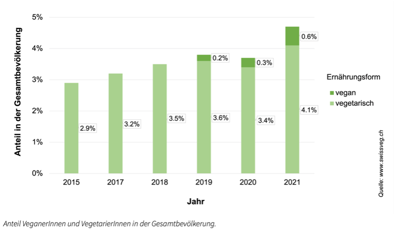

+++
title = "Was bewirkt eine Umstellung auf pflanzenbasierte Ernährung?"
date = "2023-05-07"
draft = false
pinned = false
tags = ["vegan", "vegetarisch", "gesund", "umweltfreundlich"]
image = "vegan.jpg"
description = "Die Natur ist einzigartig in ihrer Vielfalt an geniessbaren Pflanzen. Besitzt nicht fast jeder Pflanzenfreund*in ein eigenes Gärtchen, sei es auf dem Balkon oder natürlich ein Hausgarten? Im Gespräch mit dem Ehepaar von Castelberg, bekomme ich einen wunderbaren Einblick in die Welt der veganen und vegetarischen Ernährung."
footnotes = "Fig. 1: https://www.swissveg.ch/2021_10_Anzahl_Veganer_Vegetarier?language=de"
+++
Die Natur ist einzigartig in ihrer Vielfalt an geniessbaren Pflanzen. Besitzt nicht fast jeder Pflanzenfreund*in ein eigenes Gärtchen, sei es auf dem Balkon oder natürlich ein Hausgarten? Im Gespräch mit dem Ehepaar von Castelberg, bekomme ich einen wunderbaren Einblick in die Welt der veganen und vegetarischen Ernährung. 

Draussen fallen die Sonnenstrahlen auf meinen Nacken und ich spüre das Gefühl von Wärme, währenddessen ich friedlich neue Samen in einen Topf pflanze. Frische erdige Luft dringt in meine Nase. Dieses Phänomen erweckt in mir grosse Freude, gleichzeitig begrüssen mich gerade meine Interviewpartner und es fühlt sich so an, als würden wir uns schon lange kennen. Auch ihr Hund Gigino freut sich. Wir setzen uns an den vorbereiteten Tisch mit Häppchen und Getränken. In fröhlicher Stimmung beginnen wir das Interview.

# Gründe zur Umstellung der Ernährung

Viele Gründe sprechen für eine vegane Ernährung. Doch was bewirkt überhaupt eine Umstellung auf eine pflanzenbasierte Ernährung? Es wird immer deutlicher, dass der Verzehr von Tieren einen wesentlichen Faktor für globale Umweltprobleme und den Klimawandel darstellt. Die Tierwirtschaft verursacht bis zu 20 Prozent der weltweit ausgestoßenen Treibhausgase. Durch eine pflanzliche Ernährung werden viele Probleme gleichzeitig behoben, wie beispielsweise Tiere werden weniger gequält und misshandelt.  Der Anbau von Tiernahrung reduziert sich. Verringerung der Artenvielfalt, durch die ungebremste Abholzung der Regenwälder zur Schaffung von Weideflächen. Diese Aspekte führen zu einer Lebensweise ohne tierische Produkte. Die pflanzliche Ernährung hilft nicht nur vielen Tieren, sondern minimiert auch den persönlichen ökologischen Fußabdruck und trägt zur Reduzierung des Welthungers bei. Zum anderen kann pflanzenbasiertes Essen eine abwechslungsreiche und gesunde Ernährungsform bieten, da die Natur sehr viel zu zeigen hat, mit vielen neuen, speziellen Sorten von Pflanzen und Früchten. Deswegen gehört die vegan/vegetarische Ernährungsform zu einer der besten und abwechslungsreichsten Ernährungsarten.

# Ernährungsarten

Das Leben bietet uns verschiedene Varianten an, um die Ernährung umzustellen. Die omnivore Ernährung der sogenannten Allesfresser schliesst weder Fleisch, Fisch- und Meeresprodukte noch Obst oder Gemüse aus. Heutzutage gehört die omnivore Ernährung zu der grössten Nahrungspalette der Welt. Eine vegetarische Ernährung besteht grösstenteils aus pflanzlichen Produkten und wird ergänzt mit Milchprodukten und Eiern. Die vegane Ernährungsform basiert nur auf  rein pflanzlichen Produkten. Das bedeutet, dass weder Fleisch, noch Fisch, noch Milch, noch Eier und auch noch Honig oder sämtliche Produkte mit tierischen Bestandteilen, inklusive Zusatzstoffe tierischer Herkunft auf den Teller kommen. Zudem existieren auch zahlreiche Diäten.

# Kosten und Alternativprodukte 

Haben Sie sich mal die Frage gestellt, wie mehr Menschen dazu motiviert werden können, vegane Produkte zu kaufen? Darauf hat Patrick von Castelberg, eine Antwort:

> *Wenn sich die Leute das Fleisch nicht mehr leisten können, wegen hohen Realkosten oder Importe, dann werden sich die Menschen bestimmt überlegen ihre Ernährung zu ändern*. 

Als Alternativprodukte werden mittlerweile Insekten angeboten, die vor zehn Jahren noch nicht auf dem Markt eingeführt worden sind. Coop führt mit diesem Sortiment.

Von nicht-veganen Produkten kennen wir, dass Labels wie Max Havelar oder FairTrade uns beim Einkauf darauf hinweisen, ob diese Produkte schonend für Natur, Mensch und Umwelt sind. Das gilt auch für vegane und Alternativprodukte. 

# Umwelt und Klimawandel

Unsere Erde braucht jede mögliche Hilfe. Ein wichtiger Beitrag kann durch eine vollkommen pflanzlich-basierte Ernährung geleistet werden. Beispielsweise wird für ein Kilogramm Fleisch viel mehr Wasser verwendet als für ein Kilogramm Gemüse. Zudem wird durch vegetarische und vegane Ernährung die Massentierhaltung geschwächt. Auf keinen Fall wird gerechtfertigt, dass das Leben unschuldiger Tiere für den Verzehr von Fleisch geopfert wird. Zum einen gibt es heutzutage Fleischersatzprodukte und zum anderen ist Fleisch allgemein nicht überlebensnotwendig für den menschlichen Körper. Des Weiteren wird durch die Reduktion der Massentierhaltung auch mehr Nahrung und Wasser für den Menschen selbst verfügbar, da es nicht mehr für die Tiere verwendet wird. Nebst der Aufgabe die Umwelt zu schützen, gilt die Aufmerksamkeit auch dem Schutz unseres Körpers. 

# Gesundheit

Die Gesundheit ist das wichtigste im Leben. Sich vegetarisch resp. vegan zu ernähren, ist zudem auch gesund für den eigenen Körper. Patrick und Regina von Castelberg erzählen von einer siebzigjährigen Frau, die auf vegane Ernährung umgestellt hat. Vor dieser Umstellung hat sie mit Herzproblemen,  Diabetes zwei und Gelenkprobleme zu kämpfen gehabt. Kurz nach dem Wechsel auf vegane Ernährung, sind alle ihre Beschwerden verschwunden, auch Diabetes. Laut Patrick und Regina von Castelberg sei es empfehlenswert, seine Ernährung neu zu überdenken und auf eine pflanzenbasierte Ernährung umzustellen. 

> *Jedoch behaupten wir nicht, dass auf Fleischkonsum ganz verzichtet werden soll, wenn das nicht aus freien Gründen geschieht.*

Eine Umstellung auf eine pflanzenbasierte Ernährung bewirkt, ein körperliches Wohlbefinden, Gesundheit, abwechslungsreiche Ernährung und mehr Lebensqualität. 

Nach dem einstündigen Gespräch mit den von Castelbergs, weht ein jetzt frischer, leichter Wind, durch meine Haare. Die Sonnenstrahlen verschwinden hinter dem Horizont und auf dem Tisch bleiben nur noch die leeren Gläser übrig, sowie ein paar Häppchen. Ich schaue in meinen Topf und betrachte neugierig, ob sich der Samen, den ich zuvor gepflanzt hatte, sich schon ein bisschen entwickelt hat.



 und Patrick (rechts) von Castelberg")

Patrick und Regina leben seit 2009 glücklich verheiratet. Patrick von Castelberg ernährt sich seit 2011 vegan. Regina von Castelberg ernährt sich fast schon ihr ganzes Leben lang vegan. Die beiden sind nicht nur Experten*innen zum Thema Ernährung sowie Umstellung auf pflanzliche Produkte, sondern verfügen sogar über einen eigenen Fernsehsender namens: ”hoch2.tv, der Wahrheit verpflichtet”. Bei dem Fernsender von Herrn und Frau von Castelberg geht es um aktuelle Themen in der Schweiz. Patrick ist ausserdem ein talentierter Sänger und führte schon viele Auftritte als Sänger durch. Einer seiner bekanntesten Auftritte war 2017 in der Sendung «Das Supertalent». Regina ist Lehrerin an einer Grundschule, sowie diplomierte Journalistin und Schriftstellerin. Eines ihrer Bücher trägt den Namen «Mein kleiner Kater Salomon», es ist im Jahr 2013 erschienen.

